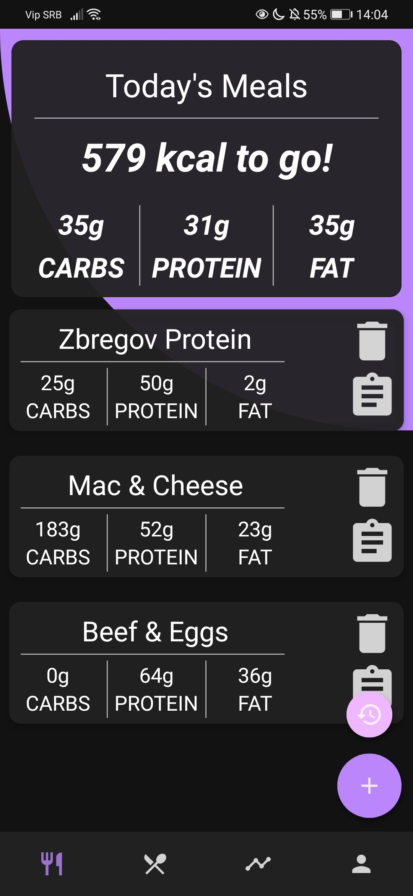
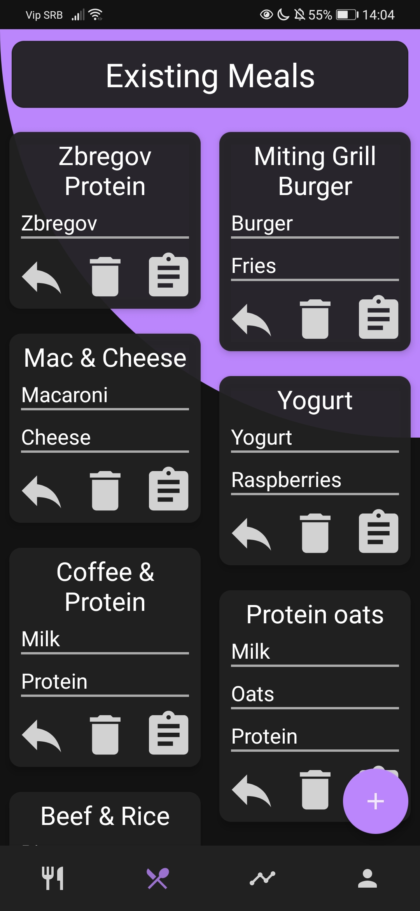
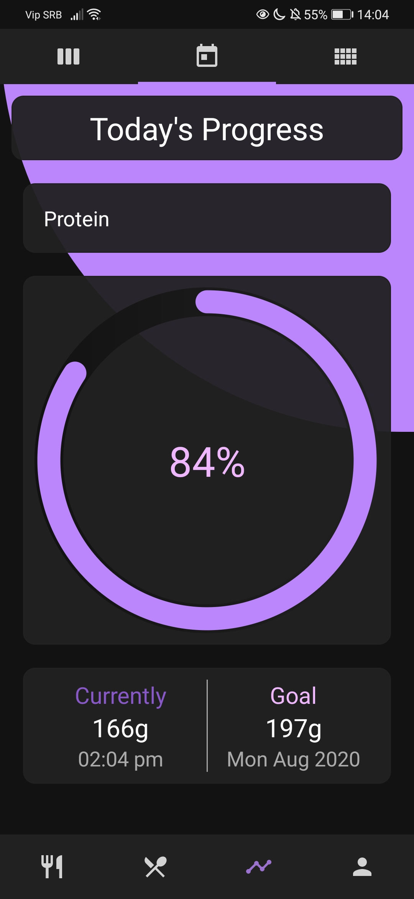
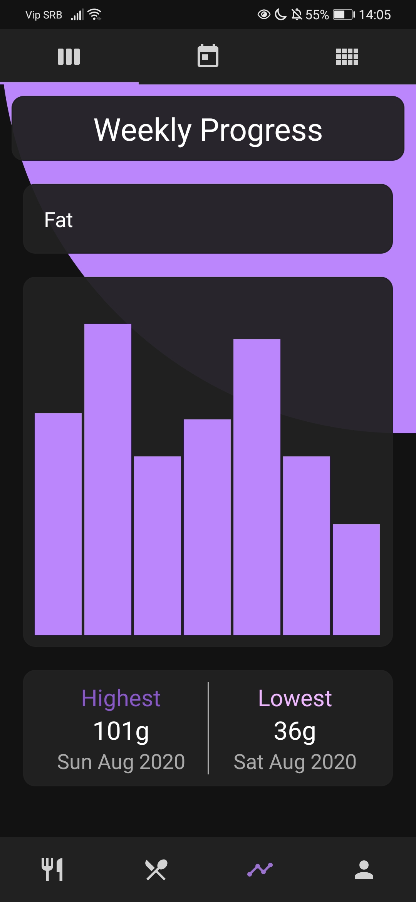
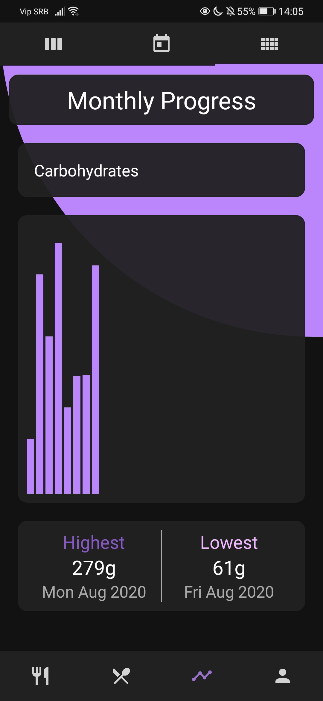
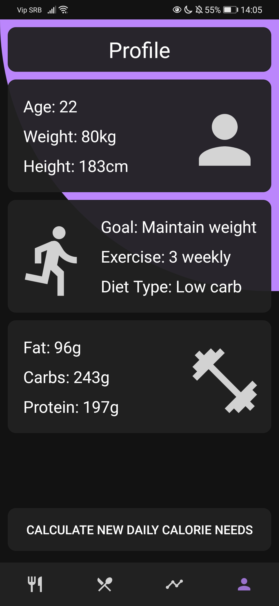
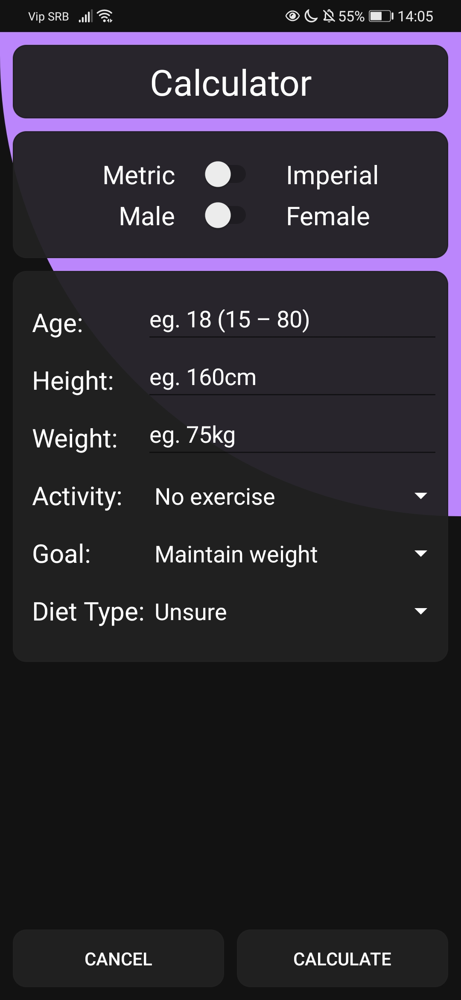
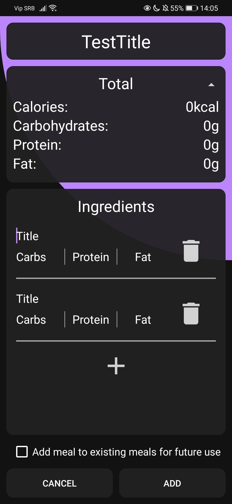
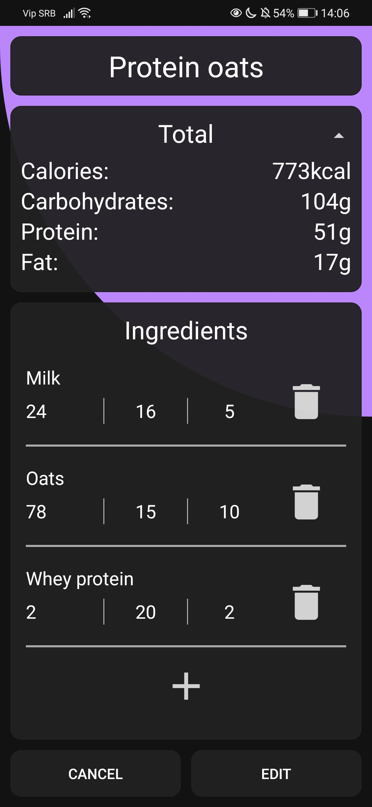

# Meal_Organizer

## Overview
This is an app that makes a process of organizing your meals much easier by helping you track your daily calories.
The app includes a calorie calculator that takes in consideration your age, height, weight, activity level, diet type and fitness goal.
The app also includes a progress tracking section where you can see your daily, weekly and monthly progress for all macronutriens.

## Updates
The app will eventually get updates that include a small food database, custom diet type and few other things.
For now it's a simple meal tracker & organizer and I hope anyone that uses it gets a good use out of it.

## Screenshots
        

## Non-commercial use
This app is my personal project and it does not have direct or indirect income-generating use. It will not be marketed or sold.

## Links
* [GitHub](https://github.com/jerinic-dusan)
* [LinkedIn](https://www.linkedin.com/in/dusan-jerinic/)
